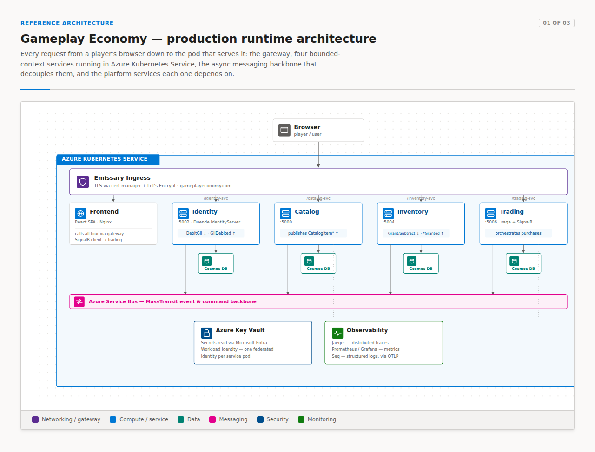
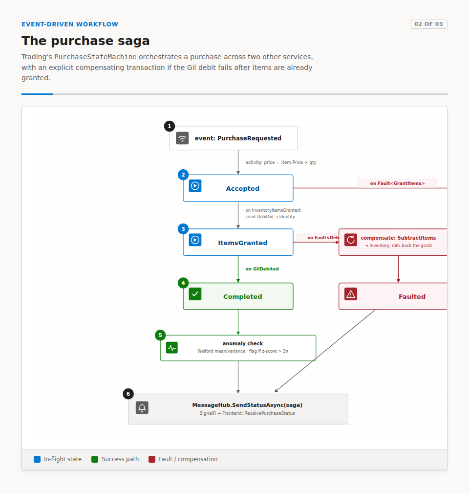
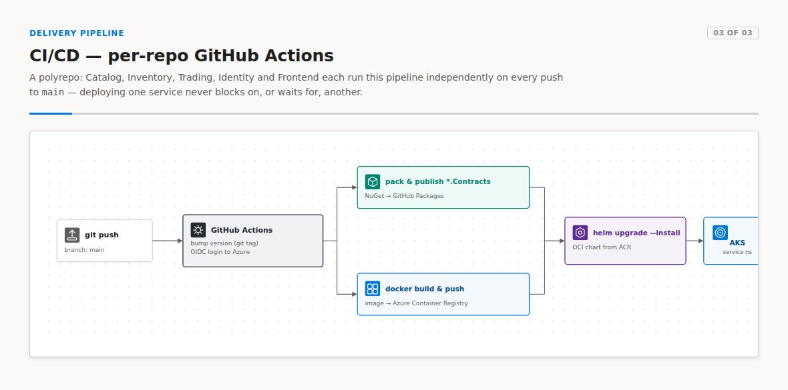

# Gameplay Economy

A production-style .NET 8 microservice system for a game item economy, covering catalog, inventory, trading, and identity, deployed to Azure Kubernetes Service.

This repo is an overview of the project. It has an architecture summary, diagrams, and links to the code for each service below. Each service lives in its own repo with its own version history and its own CI/CD pipeline, since this project is built in a true polyrepo structure, with each service as a separate, independently deployed codebase.

For the full architecture write-up, see [ARCHITECTURE.md](./ARCHITECTURE.md).

## Overview

Four backend services, Catalog, Inventory, Trading, and Identity, each own their data. They communicate asynchronously through MassTransit and deploy independently on Azure Kubernetes Service. A React frontend and all four services sit behind a single ingress gateway.

| Repo | Role |
|---|---|
| [Play.Catalog](https://github.com/dotnetmicroservice001/Play.Catalog) | Item catalog service |
| [Play.Inventory](https://github.com/dotnetmicroservice001/Play.Inventory) | Player inventory service |
| [Play.Trading](https://github.com/dotnetmicroservice001/Play.Trading) | Purchase orchestration (saga) and real-time updates |
| [Play.Identity](https://github.com/dotnetmicroservice001/Play.Identity) | Auth (Duende IdentityServer), users, in-game currency |
| [Play.Frontend](https://github.com/dotnetmicroservice001/Play.Frontend) | React SPA client |
| [Play.Common](https://github.com/dotnetmicroservice001/Play.Common) | Shared library (Mongo, MassTransit, JWT, telemetry), published as a NuGet package |
| [Play.Infra](https://github.com/dotnetmicroservice001/Play.Infra) | Infrastructure as code: Helm chart, ingress, cert-manager, observability stack |

## Highlights

**Purchase saga.** A purchase involves three services: Trading, Inventory, and Identity. A saga pattern coordinates the transaction across all three. [`PurchaseStateMachine.cs`](https://github.com/dotnetmicroservice001/Play.Trading/blob/main/src/Play.Trading.Service/StateMachines/PurchaseStateMachine.cs) is a MassTransit state machine that runs the happy path and compensates on failure. If debiting currency fails after items were already granted, it issues a `SubtractItems` command that rolls back the grant and keeps both services in sync.

Every completed purchase also runs an inline anomaly check. A running mean and variance per user, using Welford's algorithm, flags any purchase more than three standard deviations from that user's history. This check runs live inside the saga. See [`UserPurchaseStats.cs`](https://github.com/dotnetmicroservice001/Play.Trading/blob/main/src/Play.Trading.Service/Entities/UserPurchaseStats.cs).

**Independent deploys per service.** Each repo ships itself. A push to `main` bumps the version, publishes the shared event and command contracts as a NuGet package, builds and pushes a Docker image to Azure Container Registry, and rolls it out with Helm. Each service deploys on its own schedule.

**Workload identity for secrets access.** Each service's Kubernetes pod authenticates to Azure directly through [Azure AD Workload Identity](https://github.com/dotnetmicroservice001/Play.Infra/blob/main/helm/microservice/templates/serviceaccount.yaml), a federated identity per service, to read from Azure Key Vault. CI/CD authenticates to Azure the same way, through GitHub Actions OIDC.

**Event-driven communication between services.** Catalog publishes domain events. Inventory and Trading each keep their own eventually consistent read model, built from the events they consume. See [`GrantItemsConsumer.cs`](https://github.com/dotnetmicroservice001/Play.Inventory/blob/main/src/Play.Inventory.Service/Consumer/GrantItemsConsumer.cs) and the [Emissary Ingress path routing](https://github.com/dotnetmicroservice001/Play.Infra/blob/main/emissary-ingress/mappings.yaml) that fronts all five services.

## Tech stack

.NET 8 / ASP.NET Core &middot; MongoDB (Azure Cosmos DB for MongoDB in production) &middot; MassTransit over RabbitMQ (local) / Azure Service Bus (production) &middot; Duende IdentityServer (OAuth2 / OIDC + PKCE) &middot; SignalR &middot; React &middot; Azure Kubernetes Service &middot; Helm &middot; Emissary-Ingress &middot; Azure AD Workload Identity &middot; Azure Container Registry &middot; cert-manager + Let's Encrypt &middot; OpenTelemetry, Jaeger, Prometheus/Grafana, Seq &middot; GitHub Actions (per-repo CI/CD, OIDC to Azure)

## More detail

[`ARCHITECTURE.md`](./ARCHITECTURE.md) in this repo covers the full picture: service inventory, communication patterns, data and persistence, security, observability, the production Azure topology, and the CI/CD pipeline step by step.
